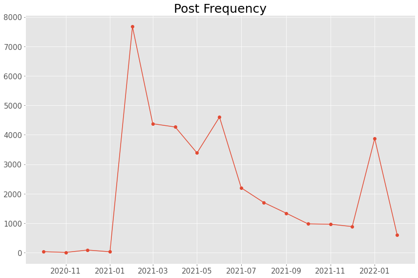
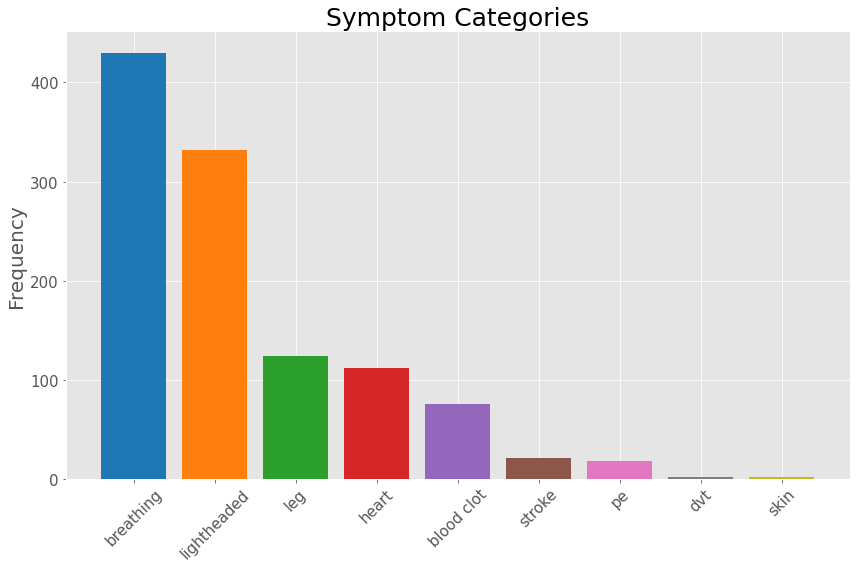
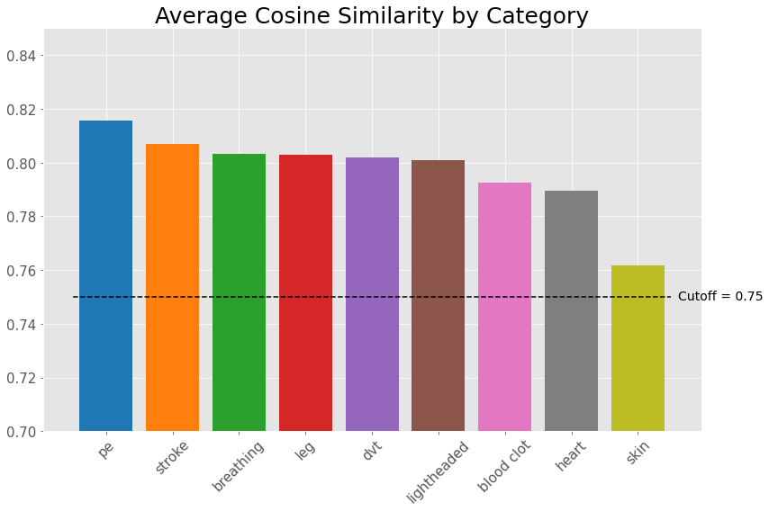
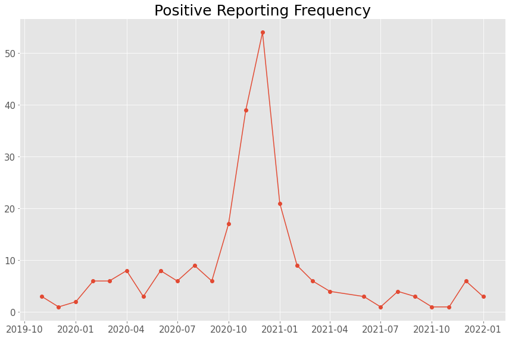
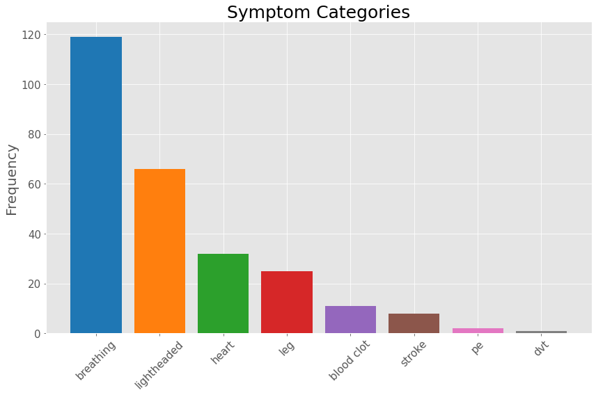
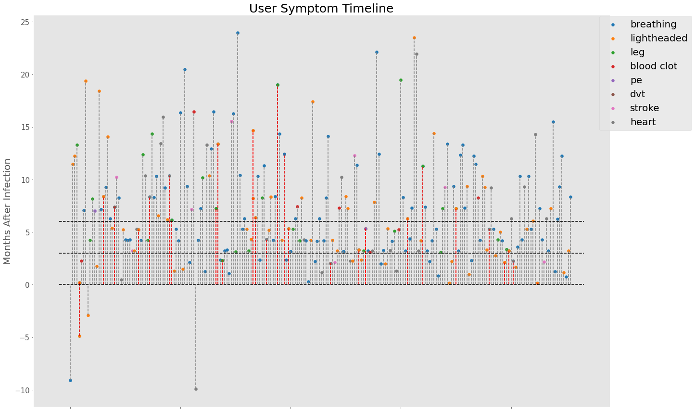

# Cardiovascular Events Following Covid-19: Final Analysis Document
##  

This document provides an outline for the entire project as well as the final analysis and aggregation of the data. This is a jupyter-notebook format converted to a markdown document that will provide project summary information, a directory of some of the existing code in this repository, and the final analysis (code, outputs, and discussion)


```python
import pandas as pd
from glob import glob
import os
import pandas as pd
import sqlite3
from matplotlib import pyplot as plt
import matplotlib.colors as mcolors
import numpy as np
from datetime import datetime
```


```python
plt.style.use("ggplot")
```


```python
def percentile(n):
    def percentile_(x):
        return np.percentile(x, n)
    percentile_.__name__ = 'percentile_%s' % n
    return percentile_
```


## Inital Data Set

All data comes from publicly accessible Facebook groups.


```python
# Load the original data set before trimming
datadir = r"C:\Users\keatu\Regis_archive\practicum_data"
dbfile = os.path.join(datadir,"Facebook.db")
con = sqlite3.connect(dbfile)
posts = pd.read_sql("select * from posts",con)
comments = pd.read_sql("select * from comments", con)
replies = pd.read_sql("Select * from replies",con)
con.close()
```

Original posts, comments, and replies had to be parsed separately. Comments and replies were originally nested within a field of the original post called "comments_full". This field contained large nested json string with all comments and comment replies. These had to be parsed separately to create the "comments" and "replies" data sets.


```python
# Combine all data types into one data frame for aggregation
posts['type'] = "posts"
comments['type'] = "comments"
replies['type'] = "replies"
all_points = pd.concat([
                    posts[["user_id","post_id","type","time"]],
                    comments[["commenter_id","comment_id","type","comment_time"]].rename(columns={"commenter_id":"user_id","comment_id":"post_id","comment_time":"time"}),
                    replies[["commenter_id","comment_id","type","comment_time"]].rename(columns={"commenter_id":"user_id","comment_id":"post_id","comment_time":"time"})
                    ], sort = False)
```


```python
len(all_points)
```


    36972


```python
# count number of unique users and posts by type
all_points.groupby("type").aggregate({"user_id":"nunique","post_id":"count"}).reset_index().rename(columns={"type":"Post Type","user_id":"Unique Users","post_id":"# of Posts"}).sort_values("# of Posts")
```


<div>
<style scoped>
    .dataframe tbody tr th:only-of-type {
        vertical-align: middle;
    }

    .dataframe tbody tr th {
        vertical-align: top;
    }

    .dataframe thead th {
        text-align: right;
    }
</style>
<table border="1" class="dataframe">
  <thead>
    <tr style="text-align: right;">
      <th></th>
      <th>Post Type</th>
      <th>Unique Users</th>
      <th># of Posts</th>
    </tr>
  </thead>
  <tbody>
    <tr>
      <td>1</td>
      <td>posts</td>
      <td>149</td>
      <td>528</td>
    </tr>
    <tr>
      <td>0</td>
      <td>comments</td>
      <td>997</td>
      <td>10782</td>
    </tr>
    <tr>
      <td>2</td>
      <td>replies</td>
      <td>954</td>
      <td>25662</td>
    </tr>
  </tbody>
</table>
</div>


```python
# look at metrics for posts per user
posts_per_user = all_points.groupby("user_id").aggregate({"post_id":"count"}).reset_index()
num_posts = posts_per_user["post_id"]
print("### Posts Per User ###")
num_posts.describe(percentiles = [.05,.95])
```

    ### Posts Per User ###
    


    count    22585.000000
    mean         8.423290
    std         21.782057
    min          1.000000
    5%           1.000000
    50%          3.000000
    95%         32.000000
    max        878.000000
    Name: post_id, dtype: float64


```python
all_points["date_time"] = pd.to_datetime(all_points['time'])
```


```python
month_counts = all_points.groupby([all_points["date_time"].dt.year, all_points["date_time"].dt.month]).aggregate({"user_id":"count"})
month_counts.index = month_counts.index.set_names(["year","month"])
month_counts = month_counts.reset_index()
month_counts["year_month"] = pd.to_datetime((month_counts["month"].astype(str)+"-"+month_counts["year"].astype(str)), format = r'%m-%Y')
```


```python
fig, ax = plt.subplots(figsize = (12,8))
ax.plot(month_counts["year_month"],month_counts["user_id"].astype(int), '-o')
ax.tick_params(axis='y', labelsize = 15)
ax.tick_params(axis='x', labelsize = 15)
ax.set_title("Post Frequency", size = 25)
#ax.set_ylim(0.7,0.85)
plt.tight_layout()
plt.show()
```





## Trim down to self-reporting symptoms

After creating the initial datasets for the posts, comments, and replies, the next big steps involved creating a method for parsing the text strings to find users self-reporting symptoms. Rather than searching for all possible symptoms, the dataset was cut down to look at only users reporting symptoms specified by the School of Pharmacy--pathologies linked to cardiovascular issues after covid.


```python
# Load the self-reporting symptoms data set
datadir = r"C:\Users\keatu\Regis_archive\practicum_data"
dbfile = os.path.join(datadir,"Facebook_Self_Report.db")
con = sqlite3.connect(dbfile)
self_reporting = pd.read_sql("select * from symptom_reporting",con)
con.close()
```


```python
self_reporting["symptom"] = self_reporting["symptom"].replace("pulmonary embolism","pe")
```


```python
self_reporting.sample(2)
```


<div>
<style scoped>
    .dataframe tbody tr th:only-of-type {
        vertical-align: middle;
    }

    .dataframe tbody tr th {
        vertical-align: top;
    }

    .dataframe thead th {
        text-align: right;
    }
</style>
<table border="1" class="dataframe">
  <thead>
    <tr style="text-align: right;">
      <th></th>
      <th>level_0</th>
      <th>index</th>
      <th>post_id</th>
      <th>cos_similarity</th>
      <th>match_sentence</th>
      <th>sentence</th>
      <th>symptom</th>
      <th>user_id</th>
    </tr>
  </thead>
  <tbody>
    <tr>
      <td>819</td>
      <td>819</td>
      <td>1069</td>
      <td>572523367421750</td>
      <td>0.8405188322067261</td>
      <td>I experienced shortness of breath</td>
      <td>I keep having bouts of shortness of breath.</td>
      <td>breathing</td>
      <td>100000190300349</td>
    </tr>
    <tr>
      <td>713</td>
      <td>713</td>
      <td>1352</td>
      <td>7530441623647925</td>
      <td>0.7706999778747559</td>
      <td>I experienced vertigo</td>
      <td>But I do get vertigo normally.</td>
      <td>lightheaded</td>
      <td>1660265883</td>
    </tr>
  </tbody>
</table>
</div>


```python
print("Total size of dataset: {}".format(len(self_reporting)))
# remove duplicate users with same symptoms
tr_self_reporting = self_reporting.sort_values("cos_similarity", ascending=False).groupby(["user_id","symptom"]).aggregate("first").reset_index()
print("Total after removing duplicates: {}".format(len(tr_self_reporting)))
```

    Total size of dataset: 1340
    Total after removing duplicates: 1119
    


```python
tr_self_reporting.head()
```


<div>
<style scoped>
    .dataframe tbody tr th:only-of-type {
        vertical-align: middle;
    }

    .dataframe tbody tr th {
        vertical-align: top;
    }

    .dataframe thead th {
        text-align: right;
    }
</style>
<table border="1" class="dataframe">
  <thead>
    <tr style="text-align: right;">
      <th></th>
      <th>user_id</th>
      <th>symptom</th>
      <th>level_0</th>
      <th>index</th>
      <th>post_id</th>
      <th>cos_similarity</th>
      <th>match_sentence</th>
      <th>sentence</th>
    </tr>
  </thead>
  <tbody>
    <tr>
      <td>0</td>
      <td>100000006464478</td>
      <td>lightheaded</td>
      <td>759</td>
      <td>1202</td>
      <td>625541365453283</td>
      <td>0.850652277469635</td>
      <td>I had vertigo</td>
      <td>Today woke up with vertigo.</td>
    </tr>
    <tr>
      <td>1</td>
      <td>100000015231412</td>
      <td>lightheaded</td>
      <td>760</td>
      <td>604</td>
      <td>487834489223972</td>
      <td>0.8121128082275391</td>
      <td>dealing with vertigo</td>
      <td>I take medicine that helps with the symptoms (...</td>
    </tr>
    <tr>
      <td>2</td>
      <td>100000019242394</td>
      <td>breathing</td>
      <td>761</td>
      <td>364</td>
      <td>457842002223221</td>
      <td>0.7837353944778442</td>
      <td>my symptoms included trouble breathing</td>
      <td>My symptoms are tight chest, breathing, brain ...</td>
    </tr>
    <tr>
      <td>3</td>
      <td>100000024506226</td>
      <td>breathing</td>
      <td>762</td>
      <td>0</td>
      <td>403584040982351</td>
      <td>0.7785392999649048</td>
      <td>I had shortness of breath</td>
      <td>I had shortness of breath, fatigue, and body p...</td>
    </tr>
    <tr>
      <td>4</td>
      <td>100000034163167</td>
      <td>pe</td>
      <td>764</td>
      <td>351</td>
      <td>456122169061871</td>
      <td>0.7947163581848145</td>
      <td>I had pulmonary embolism</td>
      <td>Some of these broke loose and went to my lungs...</td>
    </tr>
  </tbody>
</table>
</div>


```python
# plot total counts for each symptom category
fig, ax = plt.subplots(figsize = (12,8))
symptom_counts = tr_self_reporting["symptom"].value_counts()
ax.bar(symptom_counts.index,symptom_counts.values, color = list(mcolors.TABLEAU_COLORS.values()))
ax.set_xticklabels(symptom_counts.index,rotation=45, size = 15)
ax.tick_params(axis='y', labelsize = 15)
ax.set_title("Symptom Categories", size = 25)
ax.set_ylabel("Frequency", size = 20)
plt.tight_layout()
plt.show()

```





```python
# Count number of users reporting 1 or more symptoms
symptoms_per_user = tr_self_reporting.groupby("user_id").aggregate({"symptom":"count"}).reset_index()
symptoms_per_user.groupby("symptom").aggregate({"user_id":"count"}).reset_index().rename(columns={"symptom": "Symptom Count","user_id":"Total Users"})
#print(pd.DataFrame(symptoms_per_user["symptom"].value_counts(), ["# of Posts", "total users"]))
```


<div>
<style scoped>
    .dataframe tbody tr th:only-of-type {
        vertical-align: middle;
    }

    .dataframe tbody tr th {
        vertical-align: top;
    }

    .dataframe thead th {
        text-align: right;
    }
</style>
<table border="1" class="dataframe">
  <thead>
    <tr style="text-align: right;">
      <th></th>
      <th>Symptom Count</th>
      <th>Total Users</th>
    </tr>
  </thead>
  <tbody>
    <tr>
      <td>0</td>
      <td>1</td>
      <td>973</td>
    </tr>
    <tr>
      <td>1</td>
      <td>2</td>
      <td>63</td>
    </tr>
    <tr>
      <td>2</td>
      <td>3</td>
      <td>4</td>
    </tr>
    <tr>
      <td>3</td>
      <td>4</td>
      <td>2</td>
    </tr>
  </tbody>
</table>
</div>


```python
# Find highest co-incident symptoms for users reporting multiple symptoms
unique_symptoms = tr_self_reporting.groupby("user_id").aggregate({"symptom":"unique"})
unique_symptoms["symptom"] = unique_symptoms["symptom"].apply(sorted)
unique_symptoms[unique_symptoms["symptom"].map(len)>1]["symptom"].value_counts()
```


    [breathing, lightheaded]                     17
    [breathing, heart]                           13
    [breathing, leg]                              8
    [blood clot, leg]                             5
    [blood clot, breathing]                       4
    [heart, lightheaded]                          4
    [blood clot, lightheaded]                     2
    [blood clot, pe]                              2
    [lightheaded, stroke]                         1
    [blood clot, heart, leg]                      1
    [lightheaded, pe]                             1
    [breathing, heart, leg]                       1
    [breathing, pe]                               1
    [breathing, heart, lightheaded]               1
    [breathing, heart, lightheaded, pe]           1
    [leg, lightheaded]                            1
    [breathing, dvt]                              1
    [blood clot, dvt]                             1
    [breathing, stroke]                           1
    [blood clot, breathing, leg, lightheaded]     1
    [breathing, leg, lightheaded]                 1
    [blood clot, heart]                           1
    Name: symptom, dtype: int64


```python
tr_self_reporting["cos_similarity"] = tr_self_reporting["cos_similarity"].astype(float)
```


```python
# Highest confidence based on cosine similarity score
fig, ax = plt.subplots(figsize = (12,8))
symptom_scores = tr_self_reporting.groupby("symptom").aggregate({"cos_similarity":"mean"}).sort_values("cos_similarity", ascending=False).reset_index()
ax.bar(symptom_scores["symptom"],symptom_scores["cos_similarity"], color = list(mcolors.TABLEAU_COLORS.values()))
ax.hlines(y = [0.75], xmin = -0.5, xmax = 8.5, color="k", linestyle="--")
ax.text(8.6,0.749, "Cutoff = 0.75", size = 14, color="k")
ax.set_xticklabels(symptom_scores["symptom"],rotation=45, size = 15)
ax.tick_params(axis='y', labelsize = 15)
ax.set_title("Average Cosine Similarity by Category", size = 25)
ax.set_ylim(0.7,0.85)
plt.tight_layout()
plt.show()
```





## Trim down to self-reporting positive diagnosis

Next, let's examine only those users reporting a positive dianosis of Covid and, more specifically, reporting a time of diagnosis. To save processing time, this analysis was only performed on the posts from users self-reporting symptoms of interest.


```python
# Load the self-reporting positive diagnosis data set
datadir = r"C:\Users\keatu\Regis_archive\practicum_data"
dbfile = os.path.join(datadir,"Facebook_Self_Report.db")
con = sqlite3.connect(dbfile)
positive_reporting = pd.read_sql("select * from positive_reporting",con)
con.close()
```


```python
# Look at size of dataset
print("Total size of data set: {}".format(len(positive_reporting)))
print("Number of unique users: {}".format(positive_reporting.user_id.nunique()))
```

    Total size of data set: 230
    Number of unique users: 228
    


```python
positive_reporting.head()
```


<div>
<style scoped>
    .dataframe tbody tr th:only-of-type {
        vertical-align: middle;
    }

    .dataframe tbody tr th {
        vertical-align: top;
    }

    .dataframe thead th {
        text-align: right;
    }
</style>
<table border="1" class="dataframe">
  <thead>
    <tr style="text-align: right;">
      <th></th>
      <th>index</th>
      <th>cos_similarity</th>
      <th>match_sentence</th>
      <th>post_id</th>
      <th>sentence</th>
      <th>user_id</th>
      <th>time</th>
      <th>date_reported</th>
    </tr>
  </thead>
  <tbody>
    <tr>
      <td>0</td>
      <td>0</td>
      <td>0.8587771059999999</td>
      <td>diagnosed with covid</td>
      <td>459081000000000.0</td>
      <td>Diagnosed with covid December 1st.</td>
      <td>100000019242394</td>
      <td>3/3/2021 4:35</td>
      <td>12/2021</td>
    </tr>
    <tr>
      <td>1</td>
      <td>9</td>
      <td>0.761919975</td>
      <td>it has been since I had covid</td>
      <td>449846000000000.0</td>
      <td>It was almost 11 months ago I contracted Covid.</td>
      <td>100000079697297</td>
      <td>2/7/2021 23:34</td>
      <td>3/2020</td>
    </tr>
    <tr>
      <td>2</td>
      <td>10</td>
      <td>0.81340313</td>
      <td>I had covid-19</td>
      <td>621771000000000.0</td>
      <td>I had Covid in December 9th 2020.</td>
      <td>100000107921091</td>
      <td>12/3/2021 4:36</td>
      <td>12/2020</td>
    </tr>
    <tr>
      <td>3</td>
      <td>12</td>
      <td>0.7756297590000001</td>
      <td>it has been since I had covid-19</td>
      <td>467850000000000.0</td>
      <td>I had covid symptoms in Feb 2020 before it was...</td>
      <td>100000143694179</td>
      <td>3/5/2021 23:43</td>
      <td>2/2020</td>
    </tr>
    <tr>
      <td>4</td>
      <td>13</td>
      <td>0.816642284</td>
      <td>I tested positive</td>
      <td>508219000000000.0</td>
      <td>I tested positive in November.</td>
      <td>100000145906039</td>
      <td>6/8/2021 9:54</td>
      <td>11/2021</td>
    </tr>
  </tbody>
</table>
</div>


```python
positive_reporting["date_reported"] = pd.to_datetime(positive_reporting['date_reported'], format = r'%m/%Y')
```


```python
# Examine timestamps of self-reporting positive users
#positive_reporting.groupby([positive_reporting["date_reported"].dt.year, positive_reporting["date_reported"].dt.month]).aggregate({"date_reported":"count"}")
fig, ax = plt.subplots(figsize = (12,8))
month_frequency = positive_reporting.groupby("date_reported").aggregate({"user_id":"count"}).reset_index()
ax.plot(month_frequency["date_reported"],month_frequency["user_id"].astype(int), '-o')
ax.tick_params(axis='y', labelsize = 15)
ax.tick_params(axis='x', labelsize = 15)
ax.set_title("Positive Reporting Frequency", size = 25)
#ax.set_ylim(0.7,0.85)
plt.tight_layout()
plt.show()

```





```python
# Join the positive reporting user ids with the users self-reporting symptoms of interest
positive_with_symptoms = pd.merge(positive_reporting, tr_self_reporting, on="user_id", how="left", suffixes = ("_positive","_symptoms"))
```


```python
len(positive_with_symptoms)
```


    264


```python
# plot total counts for each symptom category in final data set of users reporting positive diagnosis AND symptoms of interest
fig, ax = plt.subplots(figsize = (12,8))
positive_symptom_counts = positive_with_symptoms["symptom"].value_counts()
ax.bar(positive_symptom_counts.index,positive_symptom_counts.values, color = list(mcolors.TABLEAU_COLORS.values()))
ax.set_xticklabels(positive_symptom_counts.index,rotation=45, size = 15)
ax.tick_params(axis='y', labelsize = 15)
ax.set_title("Symptom Categories", size = 25)
ax.set_ylabel("Frequency", size = 20)
plt.tight_layout()
plt.show()
```





```python
# reformat fields and calculate months after initial infection--assuming a month is ~30 days
positive_with_symptoms.rename(columns = {"time":"date_symptom","date_reported":"date_positive"}, inplace=True)
positive_with_symptoms["date_symptom"] = pd.to_datetime(positive_with_symptoms['date_symptom'])
positive_with_symptoms["months_after_infection"] = positive_with_symptoms.apply(lambda x: (x["date_symptom"] - x["date_positive"]).days/30.0, axis = 1)
```


```python
# create a timeline showing when users are reporting symptoms after initial infection date
color_vals = list(mcolors.TABLEAU_COLORS.values())
color_symptom_map = {symptom:color_vals[i] for i, symptom in enumerate(positive_with_symptoms["symptom"].unique())}
user_groups = positive_with_symptoms.groupby("user_id")
fig, ax = plt.subplots(figsize = (20,12))
user_count = 0
colors_done = []
for user in user_groups.groups.keys():
    symptom_count = 0
    for i, row in user_groups.get_group(user).iterrows():
        symptom_count+=1
        color = color_symptom_map[row["symptom"]]
        if color not in colors_done:
            colors_done.append(color)
            ax.scatter(y=row["months_after_infection"],x=user_count, color=color, marker="o", label=row["symptom"])
        else:
            ax.scatter(y=row["months_after_infection"],x=user_count, color=color, marker="o")
        if row["months_after_infection"] < 0:
            xmin = row["months_after_infection"]
            xmax = 0
        else:
            xmin = 0
            xmax = row["months_after_infection"]
        hlinecolor = "gray"
        if symptom_count>1:
            hlinecolor = "red"
        ax.vlines(x = user_count, ymin = xmin, ymax = xmax, color=hlinecolor, linestyle="--")
    user_count+=1
#ax.set_xticklabels(positive_symptom_counts.index,rotation=45, size = 15)
ax.tick_params(axis='y', labelsize = 15)
ax.set_ylabel("Months After Infection", size = 20)
ax.legend(bbox_to_anchor=[1.15,1.01], prop={'size':20})
ax.hlines(y = [0,3,6], xmin = -5, xmax = positive_with_symptoms.user_id.nunique()+5, linestyle="--")
ax.set_xticklabels("")
plt.grid(False)
ax.set_title("User Symptom Timeline", size = 25)
plt.tight_layout()
plt.show()
```





```python
positive_with_symptoms.groupby("symptom").aggregate({"user_id":"count","months_after_infection":["mean","std","min","max"]}).reset_index()
```


<div>
<style scoped>
    .dataframe tbody tr th:only-of-type {
        vertical-align: middle;
    }

    .dataframe tbody tr th {
        vertical-align: top;
    }

    .dataframe thead tr th {
        text-align: left;
    }
</style>
<table border="1" class="dataframe">
  <thead>
    <tr>
      <th></th>
      <th>symptom</th>
      <th>user_id</th>
      <th colspan="4" halign="left">months_after_infection</th>
    </tr>
    <tr>
      <th></th>
      <th></th>
      <th>count</th>
      <th>mean</th>
      <th>std</th>
      <th>min</th>
      <th>max</th>
    </tr>
  </thead>
  <tbody>
    <tr>
      <td>0</td>
      <td>blood clot</td>
      <td>11</td>
      <td>6.263636</td>
      <td>4.755358</td>
      <td>2.033333</td>
      <td>16.466667</td>
    </tr>
    <tr>
      <td>1</td>
      <td>breathing</td>
      <td>119</td>
      <td>6.841176</td>
      <td>5.068521</td>
      <td>-9.100000</td>
      <td>23.933333</td>
    </tr>
    <tr>
      <td>2</td>
      <td>dvt</td>
      <td>1</td>
      <td>7.400000</td>
      <td>NaN</td>
      <td>7.400000</td>
      <td>7.400000</td>
    </tr>
    <tr>
      <td>3</td>
      <td>heart</td>
      <td>32</td>
      <td>6.728125</td>
      <td>5.942002</td>
      <td>-9.933333</td>
      <td>21.933333</td>
    </tr>
    <tr>
      <td>4</td>
      <td>leg</td>
      <td>25</td>
      <td>7.590667</td>
      <td>4.898540</td>
      <td>2.300000</td>
      <td>19.466667</td>
    </tr>
    <tr>
      <td>5</td>
      <td>lightheaded</td>
      <td>66</td>
      <td>6.190404</td>
      <td>5.221742</td>
      <td>-4.866667</td>
      <td>23.500000</td>
    </tr>
    <tr>
      <td>6</td>
      <td>pe</td>
      <td>2</td>
      <td>6.150000</td>
      <td>1.202082</td>
      <td>5.300000</td>
      <td>7.000000</td>
    </tr>
    <tr>
      <td>7</td>
      <td>stroke</td>
      <td>8</td>
      <td>7.741667</td>
      <td>4.976923</td>
      <td>2.133333</td>
      <td>15.533333</td>
    </tr>
  </tbody>
</table>
</div>


```python
color_symptom_map
```


    {'breathing': '#1f77b4',
     'lightheaded': '#ff7f0e',
     'leg': '#2ca02c',
     'blood clot': '#d62728',
     'pe': '#9467bd',
     'dvt': '#8c564b',
     'stroke': '#e377c2',
     'heart': '#7f7f7f'}


```python

```
